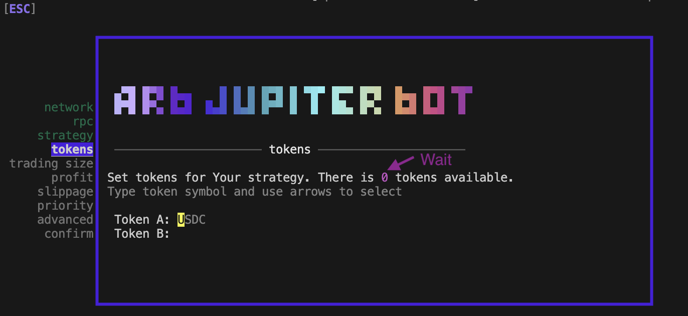
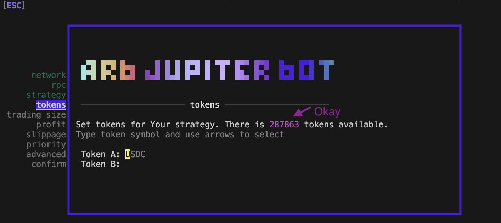

# Solana Arbitrage Bot

This bot is an open-source CLI tool that allows you to automate your crypto trading strategies on the Solana blockchain. The bot is currently written in JS and uses the Jupiter V4 SDK to find routes and execute trades.This project is built on the ARB Protocol, with fixes and optimizations applied. Their old repository is outdated and no longer functions properly.


## features

- [x] mainnet network support
- [x] all **Jupiter Aggregator** coins
- [x] easy to use **Config Wizard**
- [x] CLI UI
- **Trading strategies**
  - [x] Arbitrage strategy
  - [x] PingPong strategy
- **Slippage management**
  - [x] BPS slippage
- **Profit management**
  - [x] min profit % _(target)_
- **Charts**
  - [x] latency chart
  - [x] simulated profit chart
- **History & Statistics**
  - [x] history of trades (CLI table)
  - [x] statistics of all trades
- **Advanced**

  - [x] custom UI colors
  - [x] min. interval beetween iterations _(to avoid 429)_

- [x] hotkeys
- [x] lots of fun

# CLI UI

> ⚠️ EPILEPSY WARNING - CLI UI is constantly refreshed and may be disruptive for sensitive people

🔥 CLI UI helps you monitor your trading strategy with little impact on performance.

CLI UI currently displays a simulated profit chart and latency chart. The latency chart shows you the time taken to compute routes with Jupiter SDK.

All trades are stored in trades history and will be shown in the table. Table is limited to 5 entries, but history stores all trades.

💡 UI elements can be hidden or shown using [hotkeys](#hotkeys).


# quickstart

1. Have a [NodeJs](https://nodejs.org/en/download/package-manager) environment with version `v18.20.4 (LTS)`. Other versions have not been tested and may result in errors. Please install according to your operating system.

2. Clone this repo

```bash
git clone https://github.com/LaneOlsons/solana-arbitrage-bot && cd solana-arbitrage-bot

```

3. Install dependencies (Don't use npm)

```bash
yarn install

```

4. Enter your Solana wallet private key in the `.env` file (Please protect your private key, and if running on a server, ensure it is secure.).

```js
SOLANA_WALLET_PRIVATE_KEY=

```

5. Enter your RPC link (After completing, remember to double-check that the `.example` suffix has been removed.)

> Note: Avoid using the default RPCs, as they have rate limits. Instead, switch to a more robust node provider, such as Shyft or QuickNode.

```js
DEFAULT_RPC=https://api.mainnet-beta.solana.com
ALT_RPC_LIST=https://api.mainnet-beta.solana.com,https://solana-mainnet.genesysgo.net

```

6. Run `yarn start` to start the Config Wizard
7. Follow the steps in the Config Wizard

```
  Usage:
    $ yarn start
      This will open Config Wizard and start the bot

    $ yarn trade
      Start Bot and Trade with latest config

    $ yarn wizard
      Start Config Wizard only
```

### Explanation of Important Modifications and Notes 💡

1. Running the old repository requires holding 10K ARB tokens in the wallet. I removed this check (since I don’t like any restrictions, although I did buy some ARB tokens as a gesture of personal support).

2. Yarn has been retained as it is faster and more secure than npm. Additionally, it helps maintain the usage habits of users from the old version, allowing for a smoother transition. And there's no need to worry about outdated dependency packages, upgrading instead will affect the use of the program.

3. Some dependencies affecting program performance have been version-adjusted for perfect compatibility. Over the past month, it has performed exceptionally well (bringing me over $20,000 in profit).

4. Having a reliable RPC and server is essential. I use Shyft’s paid RPC and run it on a high-performance Linux server (Ubuntu 22.04). Mainly, since I haven’t finished my graduate studies, running it on my laptop isn’t really practical…

5. The main reason for choosing open source is that I hope to receive any substantial improvement suggestions, which are incredibly valuable to me.

6. For anyone not very familiar with arbitrage or using this program for the first time, I recommend thoroughly testing various strategies until you find the most profitable one.

7. The reason my partner and I put time and effort into this is that the Solana market is booming right now, with excellent arbitrage opportunities. In practice, this is much better than token sniping, which is overcrowded and full of scams.

8. After completing the setup and running for the first time with `yarn start`, a `config.json` file will be generated. If you want to change the strategy, you can make some manual adjustments there. Later, simply use `yarn trade` to quickly start the preset strategy. Of course, this assumes you’ve found the optimal strategy. For instance, I currently have it running on a server 24/7, using pm2 to ensure long-term operation.

9. When setting up with `yarn start`, the token list may load slowly. If you attempt to configure using `↑` `↓` and `Enter` before the list is fully loaded, you may encounter errors. So, please wait a few seconds as shown in the image below…



> Note: The program is currently working fine. If you encounter any issues during use, please review the instructions a few times (they’re already very clear). If problems persist, feel free to contact me.


### some tips 👀

🔨 The bot is a Tool, not a holy grail that will make you rich just by running it. If you don't know what you are doing, you WILL lose money.

👉 RPC / Network speed & good trading strategy is the key to success. You can speed up the bor but disabling AMMS not being used or too slow.

🙉 Not everything is so obvious. eg. a larger trade size can lead to smaller profits than a lower trade size.

🛑 If you frequently get 429 errors, you should increase the `minInterval` in the config (`Advanced` step).

🥵 You want to `arbitrage` USDC or USDT? YES! Guess what? E V E R Y O N E wants to arbitrage USDC or USDT. If you don't have access to a super fancy RPC, there is a good chance you will end up with lots of 'Slippage errors'.

🥶 `SLIPPAGE ERRORS` are not bot errors. They are part of the Solana blockchain. If you want to avoid them you have to go with the super fancy RPC or pick the less popular pairs/coins - just try to find out which ones hold profit opportunities.

🏓 `PingPong` strategy is really poweful on sideways markets. Search through charts the coins that are constantly moving up and down.

📡 If you can't run the bot, it's likely something wrong with the network, RPC, or config file.

😬 Don't like the intro? You can disable it in the .env file with `SKIP_INTRO=true`


# hotkeys

While the bot is running, you can use some hotkeys that will change the behaviour of the bot or UI

`[H]` - show/hide Help

`[CTRL] + [C]` - obviously it will kill the bot

`[I]` - incognito RPC _Hide RPC address - helpful when streaming / screenshotting_

`[E]` - force execution with current setup & profit _*(may result in loss - you bypass all rules)*_

`[R]` - force execution, stop the bot _*(may result in loss - you bypass all rules)*_

`[L]` - show/hide latency chart (of Jupiter `computeRoutes()`)

`[P]` - show/hide profit chart

`[T]` - show/hide trade history table \*_table isn't working yet_

`[S]` - simulation mode switch (enable/disable trading)


## Balance management and error handling

Balances are checked when the bot loads and also as it is running to avoid it running when there is insufficient balance (to help prevent spamming NSF transactions). There is also a setting in the bot that will end the process when too many errors have stacked up. This acts as a fail-safe. It is set to 100 errors at the moment. If you want to adjust this setting it is located currently in the /src/bot/swap.js file line 78.

	if (cache.tradeCounter.errorcount>100){
		console.log('Error Count is too high for swaps: '+cache.tradeCounter.errorcount);
		console.log('Ending to stop endless transactions failing');
		process.exit();
	}


## Slippage management

Advanced slippage handling has been added to the code. USE AT YOUR OWN RISK! To enable it you need to set adaptiveSlippage: 1 in the config.json to enable this feature. This will adjust the slippage for the route to be a percentage of the total less the required profit. It takes the simulated profit and removes the percentage required profit to create an adaptive slippage with some handling for the size of the profit detected. Related code area is shown below anv can be edited as needed.
	
	var slippagerevised = (100*(simulatedProfit-cache.config.minPercProfit+(slippage/100))).toFixed(3)
	
	if (slippagerevised>500) {
		// Make sure on really big numbers it is only 30% of the total
		slippagerevised = (0.3*slippagerevised).toFixed(3);
	} else {
		slippagerevised = (0.8*slippagerevised).toFixed(3);
	}


## BPS slippage

Simple BPS slippage. The slippage is set in the Jupiter SDK. Make sure your percentage profit is a few points above the slippage. For instance 0.1% profit would need to have a slippage BPS below 10 to break even. Best to leave a little wiggle rooom for safety as low liquidity can cause your result to be a new netagive. Always test and check to make sure you are trading in a pair that can support the size you are swapping.


## Speed of Lookups

One way you can speed up the lookup of the bot is to disable unused routes or ones that are too slow to be meaningful. Be careful here as you do not want to turn off the wrong ones. You can check with Birdeye and Jupiter front end to see the main pools and then do an analysis of the key ones for the pair you are swapping. Others can be turned off to gain some speed. Always test with a small amount and expect you will LOSE to begin with if you turn off so many you access only low liquidity pools. Edit at your own RISK.

Edit the /src/bot/setup.js file to alter these settings:

To turn one **off**, set the value to **true**

			ammsToExclude: {
                        'Aldrin': false,
                        'Crema': false,
                        'Cropper': true,
                        'Cykura': true,
                        'DeltaFi': false,
                        'GooseFX': true,
                        'Invariant': false,
                        'Lifinity': false,
                        'Lifinity V2': false,
                        'Marinade': false,
                        'Mercurial': false,
                        'Meteora': false,
                        'Raydium': false,
                        'Raydium CLMM': false,
                        'Saber': false,
                        'Serum': true,
                        'Orca': false,
                        'Step': false, 
                        'Penguin': false,
                        'Saros': false,
                        'Stepn': true,
                        'Orca (Whirlpools)': false,   
                        'Sencha': false,
                        'Saber (Decimals)': false,
                        'Dradex': true,
                        'Balansol': true,
                        'Openbook': false,
                        'Marco Polo': false,
                        'Oasis': false,
                        'BonkSwap': false,
                        'Phoenix': false,
                        'Symmetry': true,
                        'Unknown': true			
			}


## Pro ARB trading configurations

In some circumstances -- when speed is a key element to the success of ARB trading, enabling the setting `onlyDirectRoutes: true` may be an option to explore. This feature limits the available routes supplied via the JUP4 SDK to a subset of what is available by only returning direct routes.

It is possible this can help make things route faster and convert more trades. It definitely does not guarantee the best route.  You need to ensure the routes and pools are sufficient for the amount you are trading. So **always test** with a very small amount and **use at your own risk**. Setting it on the wrong pair can cause you to lose tokens. 

This setting can be found in the ./src/bot/index.js file as shown below:

	const routes = await jupiter.computeRoutes({
		inputMint: new PublicKey(inputToken.address),
		outputMint: new PublicKey(outputToken.address),
		amount: amountInJSBI,
		slippageBps: slippage,
		feeBps: 0,
		forceFetch: true,
		**onlyDirectRoutes: false,**
            	filterTopNResult: 2,
		enforceSingleTx: false,
		swapMode: 'ExactIn',
	});


## contributing

A big thank you to all ARB Protocol developers and everyone who has contributed to the current version!
<a href="">
  
</a>

If you have any ideas or suggestions for improvement while using it, please feel free to contact me.

`Discord: lane2001` 
`Email: lane2001@gmail.com`


## risk disclaimer

> [!IMPORTANT]
> This software is provided as is, without any warranty of any kind, express or implied, including but not limited to the warranties
> of merchantability, fitness for a particular purpose, and non-infringement. In no event shall the authors be liable for any claim, 
> damages, or other liability.
